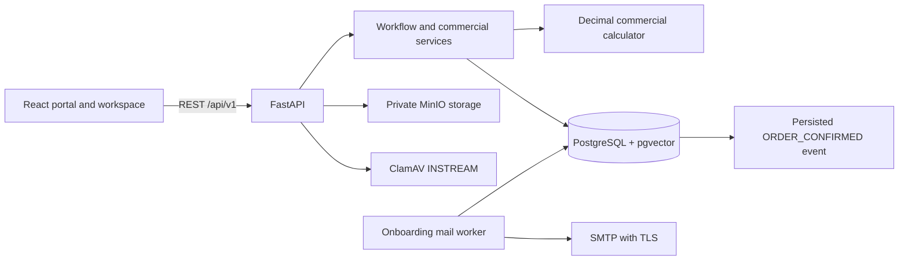

# Partner Portal — Architecture

As implemented on 1 October 2026. Business decisions are defined in [Commercial-Model.md](Commercial-Model.md); [Commercial-Implementation.md](Commercial-Implementation.md) records commercial verification and deployment limits, and [onboarding.md](onboarding.md) records the document-review and activation workflow.

## 1. Runtime architecture



The frontend uses React 19, TypeScript, Vite, React Router and TanStack Query. The backend uses FastAPI, Pydantic 2, SQLAlchemy 2 async sessions and Alembic. PostgreSQL, MinIO and ClamAV remain external runtime dependencies in local development and production. Production onboarding additionally requires an SMTP service with TLS and a continuously running mail worker using the same application image and configuration as the API. pgvector is enabled by the foundation migration; semantic search and RAG are not implemented. External event publication and downstream project creation are also deferred.

## 2. Actual code organization

```text
backend/
  alembic/versions/        Six versioned migrations
  app/
    api/v1/endpoints/     Authentication, onboarding, partners, catalog, sales and commercial APIs
    core/                 Settings, JWT/security, errors, logging and middleware
    db/                   Metadata, async sessions and idempotent seeds
    domain/               Pure commercial, access, document and workflow rules
    models/               SQLAlchemy persistence models, including onboarding/outbox state
    schemas/              Pydantic API contracts
    services/             Pricing, engagement, onboarding, mail delivery, access and audit
    storage/              MinIO client and bucket bootstrap
  tests/                  Unit and isolated API/database tests
frontend/
  src/
    api/client.ts         Shared API client and workspace contracts
    app/App.tsx           Public and protected route definitions
    features/auth/        Authentication and protected-route boundary
    features/portal/      Public pages, registration, content, artwork and scoped styles
    features/commercial/  Participants/components, terms and agreement editors
    layouts/AppLayout.tsx Authenticated navigation
    pages/                Operational workspace screens
    styles.css            Workspace styles
  scripts/                Browser and disposable PostgreSQL migration checks
```

## 3. Persistence model

| Domain | Implemented tables / representation |
| --- | --- |
| Identity | `users`, `roles`, `permissions`, `user_roles`, `role_permissions` |
| Shared organizations | `organizations`; mappings on `partners`, `customers` and `products.owner_organization_id` |
| Partner profiles | Existing `partners`, `partner_types` capability catalog, `partner_capabilities`, `countries`, `partner_countries` |
| Onboarding | `onboarding_applications`, versioned `onboarding_documents`, durable `onboarding_mail`, database-backed `onboarding_rate_limits` |
| Independent relationships | `vendor_profiles`, `partner_agreements`, `vendor_agreements` |
| Catalog | `products`, `skus`, `product_prices` |
| Opportunities | `customers`, `opportunities`, `opportunity_stage_history` |
| Participation and delivery | `opportunity_participants`, `opportunity_role_assignments`, `solution_components`, `opportunity_vendor_links` |
| Commercial terms | `commercial_contracts`, `commercial_term_versions` with validated parameter/allocation JSON |
| Quote history | `quotes`, `quote_items`, `quote_revisions`, `commercial_snapshots` |
| Conversion and commission | `conversion_evidence`, `commission_accruals`, `commission_adjustments`, `commission_payments` |
| MAF and orders | `maf_requests`, `orders` with copied accepted quote snapshot, `order_status_history` |
| Content | `documents`, `document_versions`, shared `stored_attachments` |
| Platform | `audit_logs`, `seed_records`, `domain_events` |

`partners` remains the profile table rather than introducing a duplicate `partner_profiles` table. Computed allocations live in immutable snapshot JSON, not a separate mutable allocation table. Historical tier tables, partner-type pricing rules and partner overrides remain in the schema for compatibility; new pricing never reads them. There are no separate order-item, per-workflow attachment or notification tables in this baseline.

## 4. Authorization boundaries

JWT authentication identifies an active user. Backend role checks distinguish TCG Admin/Sales from Partner Admin/Sales/Pre-Sales/Delivery; `sales.manage` governs sales mutations where required. Administration of organizations, agreements, term approval and commission settlement is TCG Admin controlled.

Partner opportunity access requires an active partner, a currently approved capability, active explicit membership and a suitable grant (`NONE`, `PROGRESS` or `COMMERCIAL`). Reseller/SI commercial sharing additionally checks contracting parties on quote/order lists and actions. Vendor participation grants no access. A null primary partner never means unrestricted access.

Referral users can view their submission/progress and own forecast/accrual, while customer quote/order execution remains with TCG. Partner deal responses redact actual contract values and stage-history notes. Snapshot responses expose only the requesting organization's entitlement. Document downloads and nested attachments repeat authorization checks; linked vendor contracts remain internal and unshared commercial-contract documents are excluded.

Frontend navigation is not a security boundary. Authentication changes clear cached query data so one account cannot inherit another account's cached workspace results.

Reseller and Referral applicants remain inactive until assigned Legal review, document approval and email OTP verification complete. Application tokens are versioned and separate from login JWTs. Normal partner approval, status changes and authentication repeat the activation guard so an incomplete onboarding record cannot be bypassed.

## 5. Commercial resolution and calculation

For each compatible parameter, approved terms resolve from highest to lowest priority:

```text
Contract > Opportunity > Effective partner agreement > Engagement default > Catalog price
```

Resolution is constrained by engagement model, effective dates and SKU scope. Equal-specificity overlaps are rejected. Explicit zero remains an override. A fixed unit price replaces catalog pricing; percentage discounts do not stack. `services/pricing.py` provides catalog/agreement previews; quote line creation also resolves opportunity and contract terms.

`domain/commercial.py` is a pure decimal calculator. USD amounts use half-up rounding to two decimals, with split residuals assigned to the named beneficiary. It returns distinct customer value, TCG entitlement, partner benefit, vendor cost, commission expense, reseller margin and SI project-share measures. Vendor costs retain their payer; only explicitly named costs reduce an SI pool.

## 6. Transaction and history boundaries

- Opportunity commercial edits lock the opportunity and compare `expected_version`; approved structural/term changes require reapproval.
- Customer/product protection checks use PostgreSQL transaction advisory locks. Approved nonterminal deals block conflicts until their 90-day protection expiry.
- Term approval serializes equal-scope changes and checks date overlap. Superseding terms create a new version instead of replacing historical parameters.
- Quote finalization verifies draft line prices/sources are current, validates roles and commercial inputs, and writes both a numbered quote revision and a commercial snapshot.
- Acceptance checks the current commercial version and approval state. Reseller acceptance belongs to the wholesale buyer; SI acceptance follows the contracting buyer; TCG records external customer acceptance for Direct/Referral.
- Orders copy the accepted revision. Later catalog, default or vendor changes never recalculate that stored history.
- Conversion evidence references the agreed snapshot. Only WON plus conversion can create commission, using frozen rates/treatments with actual eligible revenue.
- A unique qualifying-event/beneficiary key prevents duplicate accrual. Adjustments and payments use unique references; payments also check ledger version and outstanding balance. They are separate append-only records.
- PostgreSQL triggers block changes to commercial snapshots, quote revisions, conversion evidence and commission ledger rows, and protect approved term parameters. Accepted structures require an amendment reason; accepted contract term changes require a new contract.

`ORDER_CONFIRMED` is stored in `domain_events` in the order-confirmation transaction. No external publisher, payment processor or automatic fulfilment worker is included.

## 7. Object storage and API behavior

Shared-library and workflow uploads pass through the backend, are limited to 25 MB and must be nonempty. PostgreSQL retains metadata, SHA-256 checksum, uploader and private object key. MinIO stores the binary; authorized downloads use ten-minute presigned URLs.

Onboarding documents use a separate private model and object-key prefix. Each PDF, PNG or JPEG is limited to 10 MB, checked against its file signature and extension, scanned synchronously through ClamAV INSTREAM, and stored only after a clean scan. Local development and production fail closed when scanning is missing or unavailable. The API readiness endpoint continues to check only PostgreSQL and MinIO, so ClamAV and the mail worker require separate operational monitoring.

Document versions use keys under `documents/{document_id}/v{version}/`; workflow files use the lowercased owner type and owner ID. Document categories and visibility are validated server-side. `PARTNER_TYPE` remains the capability-scope API name; `PARTNER_TIER` is retired.

APIs are under `/api/v1`, with UUIDs, UTC timestamps, request IDs and a common error envelope. Partner listing is paginated; not every workflow list has pagination. `/health/live` verifies API liveness and `/health/ready` checks database/storage readiness. The frontend readiness query runs on `/system`.

## 8. Migration and operation

Schema head is `20261001_0006`. Revision `20260930_0005` maps organizations/capabilities, classifies supported legacy evidence, queues existing opportunities for commercial review, restricts tier-scoped documents and preserves finalized monetary history. Revision `20261001_0006` adds onboarding review, versioned private documents, durable mail and rate limiting. It creates draft onboarding records for existing pending Reseller/Referral partners and deactivates their users until review and verification complete. Both migrations refuse destructive downgrade; recovery requires a reviewed backup.

Use the [operations guide](Phase1-Implementation.md) for backup, migration, seed and startup commands. Local isolated tests do not replace target-environment acceptance. Future modules include project delivery, support/SLA, subscriptions, renewals, enablement, analytics and AI search; see [Phases.md](Phases.md).
